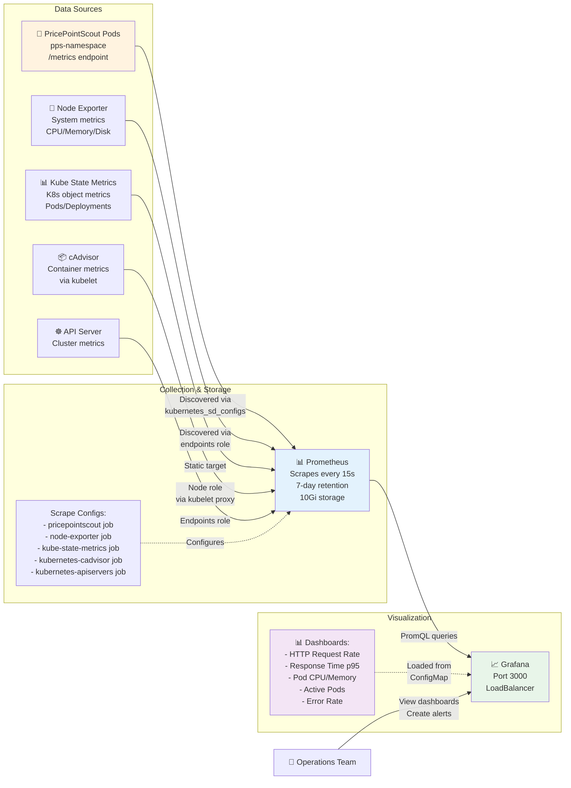
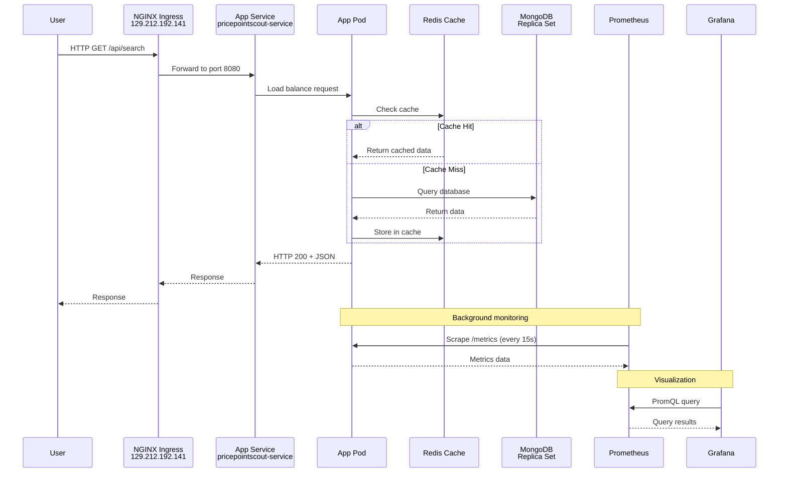
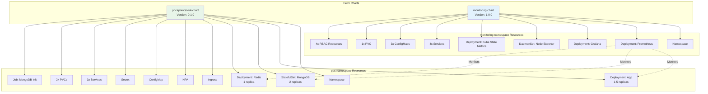
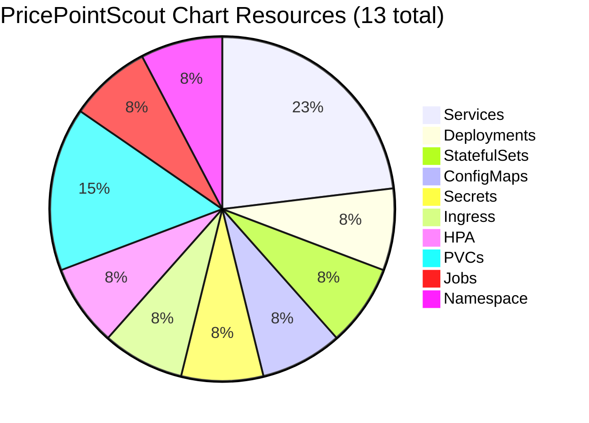
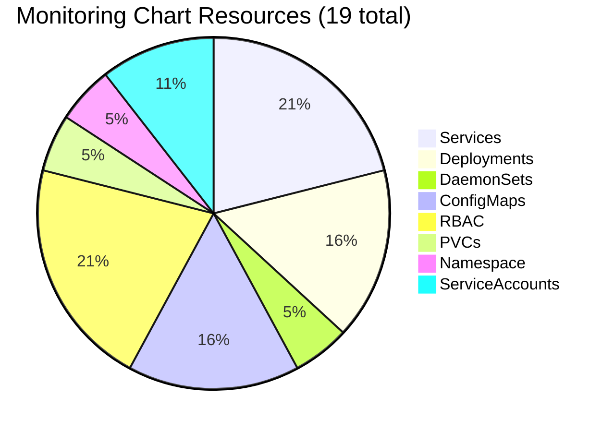

# PricePointScout Kubernetes Architecture

## Mermaid Diagram (Rendered in VS Code/GitHub)

### Complete Architecture

```mermaid
graph TB
    subgraph Internet
        Users[👥 Users]
        IngressIP[🌐 Ingress<br/>129.212.192.141]
    end

    subgraph "Ingress Controller Namespace"
        NginxIngress[NGINX Ingress Controller<br/>LoadBalancer Service]
    end

    Users -->|HTTP| IngressIP
    IngressIP --> NginxIngress

    subgraph "pps-namespace"
        Ingress[📡 Ingress Resource<br/>Path: /api/*]
        
        subgraph "Application Layer"
            AppService[🔌 Service<br/>pricepointscout-service<br/>Port: 8080]
            AppPod1[🚀 App Pod 1<br/>Port: 8080<br/>/metrics endpoint]
            AppPod2[🚀 App Pod 2<br/>Port: 8080<br/>/metrics endpoint]
            AppPod3[🚀 App Pod 3<br/>Port: 8080<br/>/metrics endpoint]
            HPA[📊 HPA<br/>Min: 1, Max: 5<br/>CPU: 70%, Mem: 75%]
        end

        subgraph "Database Layer"
            MongoHeadless[🔌 Headless Service<br/>mongodb-headless-service<br/>Port: 27017]
            Mongo0[🗄️ MongoDB Pod 0<br/>PRIMARY<br/>PVC: 1Gi]
            Mongo1[🗄️ MongoDB Pod 1<br/>SECONDARY<br/>PVC: 1Gi]
            MongoInit[⚙️ Init Job<br/>Helm Hook<br/>rs.initiate]
        end

        subgraph "Cache Layer"
            RedisService[🔌 Service<br/>redis-service<br/>Port: 6379]
            RedisPod[💾 Redis Pod<br/>LRU Eviction]
        end

        ConfigMap[📋 ConfigMap<br/>DATABASE URL<br/>JWT Config]
        Secret[🔐 Secret<br/>JWT_SECRET<br/>JWT_EXPIRES_IN]
    end

    NginxIngress -->|Routes traffic| Ingress
    Ingress --> AppService
    AppService --> AppPod1
    AppService --> AppPod2
    AppService --> AppPod3
    
    HPA -.->|Scales| AppPod1
    HPA -.->|Scales| AppPod2
    HPA -.->|Scales| AppPod3

    AppPod1 -->|Reads config| ConfigMap
    AppPod2 -->|Reads config| ConfigMap
    AppPod3 -->|Reads config| ConfigMap
    
    AppPod1 -->|Reads secrets| Secret
    AppPod2 -->|Reads secrets| Secret
    AppPod3 -->|Reads secrets| Secret

    AppPod1 -->|Connects| MongoHeadless
    AppPod2 -->|Connects| MongoHeadless
    AppPod3 -->|Connects| MongoHeadless
    
    MongoHeadless --> Mongo0
    MongoHeadless --> Mongo1
    
    MongoInit -.->|Initializes| Mongo0
    
    Mongo0 <-->|Replica Set<br/>Replication| Mongo1

    AppPod1 -->|Cache queries| RedisService
    AppPod2 -->|Cache queries| RedisService
    AppPod3 -->|Cache queries| RedisService
    
    RedisService --> RedisPod

    subgraph "monitoring namespace"
        subgraph "Metrics Collection"
            Prometheus[📊 Prometheus<br/>Port: 9090<br/>Retention: 7d<br/>PVC: 10Gi]
            PrometheusConfig[📋 Prometheus ConfigMap<br/>Scrape Configs]
            PrometheusSvc[🔌 Service<br/>prometheus-service<br/>ClusterIP: 9090]
        end

        subgraph "Visualization"
            Grafana[📈 Grafana<br/>Port: 3000<br/>admin/admin123]
            GrafanaSvc[🔌 Service<br/>grafana<br/>LoadBalancer: 3000]
            GrafanaDatasource[📋 Datasource ConfigMap<br/>→ Prometheus]
            GrafanaDashboards[📋 Dashboards ConfigMap<br/>PricePointScout Dashboard]
        end

        subgraph "System Metrics"
            NodeExporter1[📡 Node Exporter<br/>DaemonSet Pod 1<br/>Port: 9100]
            NodeExporter2[📡 Node Exporter<br/>DaemonSet Pod 2<br/>Port: 9100]
            NodeExporterSvc[🔌 Service<br/>node-exporter<br/>Headless]
        end

        subgraph "K8s Metrics"
            KSM[📊 Kube State Metrics<br/>Port: 8080<br/>Cluster-wide metrics]
            KSMSvc[🔌 Service<br/>kube-state-metrics<br/>Headless]
        end

        PrometheusRBAC[🔐 RBAC<br/>ClusterRole<br/>ServiceAccount]
        KSMRBAC[🔐 RBAC<br/>ClusterRole<br/>ServiceAccount]
    end

    Prometheus -->|Reads config| PrometheusConfig
    Prometheus -->|Uses| PrometheusRBAC
    PrometheusSvc --> Prometheus

    Prometheus -->|Scrapes /metrics| AppPod1
    Prometheus -->|Scrapes /metrics| AppPod2
    Prometheus -->|Scrapes /metrics| AppPod3
    
    Prometheus -->|Discovers & scrapes| NodeExporterSvc
    NodeExporterSvc --> NodeExporter1
    NodeExporterSvc --> NodeExporter2

    Prometheus -->|Scrapes| KSMSvc
    KSMSvc --> KSM
    KSM -->|Uses| KSMRBAC

    Prometheus -->|Scrapes kubelet| K8sAPI[☸️ Kubernetes API<br/>cAdvisor metrics]

    Grafana -->|Queries| PrometheusSvc
    Grafana -->|Loads| GrafanaDatasource
    Grafana -->|Loads| GrafanaDashboards
    GrafanaSvc --> Grafana

    Users2[👥 Ops Team] -->|Access Grafana UI| GrafanaSvc

    subgraph "Storage"
        StorageClass[💿 StorageClass<br/>do-block-storage]
        MongoPVC0[PVC: mongodb-pvc-0<br/>1Gi]
        MongoPVC1[PVC: mongodb-pvc-1<br/>1Gi]
        PrometheusPVC[PVC: prometheus-pvc<br/>10Gi]
    end

    Mongo0 -.->|Mounts| MongoPVC0
    Mongo1 -.->|Mounts| MongoPVC1
    Prometheus -.->|Mounts| PrometheusPVC
    
    MongoPVC0 -.->|Uses| StorageClass
    MongoPVC1 -.->|Uses| StorageClass
    PrometheusPVC -.->|Uses| StorageClass

    style Users fill:#e1f5ff
    style Users2 fill:#e1f5ff
    style IngressIP fill:#fff4e6
    style NginxIngress fill:#fff4e6
    style Ingress fill:#fff4e6
    style AppPod1 fill:#e8f5e9
    style AppPod2 fill:#e8f5e9
    style AppPod3 fill:#e8f5e9
    style Mongo0 fill:#f3e5f5
    style Mongo1 fill:#f3e5f5
    style RedisPod fill:#ffebee
    style Prometheus fill:#e3f2fd
    style Grafana fill:#e3f2fd
    style NodeExporter1 fill:#fce4ec
    style NodeExporter2 fill:#fce4ec
    style KSM fill:#fce4ec
```



### Monitoring Stack Detail



### Traffic Flow



### Deployment Relationships



### Resource Count Summary





## ASCII Diagram

```
┌─────────────────────────────────────────────────────────────────────────────────┐
│                                    INTERNET                                     │
│                          Users → 129.212.192.141                                │
└────────────────────────────────────┬────────────────────────────────────────────┘
                                     │
                                     ▼
┌─────────────────────────────────────────────────────────────────────────────────┐
│                          NGINX Ingress Controller                               │
│                         (ingress-nginx namespace)                               │
└────────────────────────────────────┬────────────────────────────────────────────┘
                                     │
                                     ▼
┌─────────────────────────────────────────────────────────────────────────────────┐
│                             pps-namespace                                       │
│                                                                                 │
│  ┌──────────────────────────────────────────────────────────────────────────┐  │
│  │  Ingress Resource (Path: /api/*)                                         │  │
│  └────────────────────────────────┬─────────────────────────────────────────┘  │
│                                   │                                             │
│  ┌────────────────────────────────▼─────────────────────────────────────────┐  │
│  │  Service: pricepointscout-service (ClusterIP:8080)                       │  │
│  └────────────┬───────────────────┬────────────────────┬────────────────────┘  │
│               │                   │                    │                        │
│  ┌────────────▼────┐  ┌───────────▼────┐  ┌───────────▼────┐                  │
│  │  App Pod 1      │  │  App Pod 2      │  │  App Pod 3      │                  │
│  │  - Port 8080    │  │  - Port 8080    │  │  - Port 8080    │                  │
│  │  - /metrics     │  │  - /metrics     │  │  - /metrics     │                  │
│  │  - 1-1.5 CPU    │  │  - 1-1.5 CPU    │  │  - 1-1.5 CPU    │                  │
│  │  - 1-3Gi RAM    │  │  - 1-3Gi RAM    │  │  - 1-3Gi RAM    │                  │
│  └────────┬────────┘  └────────┬─────────┘  └────────┬─────────┘                │
│           │                    │                     │                          │
│           │  ┌─────────────────┴─────────────────────┴───────────┐              │
│           │  │          HPA (1-5 replicas)                       │              │
│           │  │          CPU: 70%, Memory: 75%                    │              │
│           │  └───────────────────────────────────────────────────┘              │
│           │                                                                      │
│  ┌────────▼──────────────────────────────────────────────────────┐              │
│  │  ConfigMap: DATABASE, JWT config                              │              │
│  └────────────────────────────────────────────────────────────────┘             │
│  ┌───────────────────────────────────────────────────────────────┐              │
│  │  Secret: JWT_SECRET, JWT_EXPIRES_IN                           │              │
│  └───────────────────────────────────────────────────────────────┘              │
│                                                                                  │
│  ┌───────────────────────────────────────────────────────────────┐              │
│  │  MongoDB Headless Service (mongodb-headless-service:27017)    │              │
│  └────────────┬───────────────────────┬──────────────────────────┘              │
│               │                       │                                         │
│  ┌────────────▼────────┐  ┌───────────▼──────────┐                             │
│  │  mongodb-0          │  │  mongodb-1            │                             │
│  │  PRIMARY            │◄─┤  SECONDARY            │                             │
│  │  PVC: 1Gi           │  │  PVC: 1Gi             │                             │
│  │  ReplicaSet: rs0    │──┤  ReplicaSet: rs0      │                             │
│  └─────────────────────┘  └───────────────────────┘                             │
│           ▲                                                                     │
│           │ Initializes (Helm Hook: post-install)                               │
│  ┌────────┴──────────────────────────────────────────┐                          │
│  │  Job: mongodb-init-job                            │                          │
│  │  - Waits for all pods ready                       │                          │
│  │  - Runs rs.initiate() if needed                   │                          │
│  └───────────────────────────────────────────────────┘                          │
│                                                                                  │
│  ┌───────────────────────────────────────────────────┐                          │
│  │  Redis Service (redis-service:6379)               │                          │
│  └────────────┬──────────────────────────────────────┘                          │
│               │                                                                  │
│  ┌────────────▼──────────┐                                                      │
│  │  Redis Pod            │                                                      │
│  │  - LRU Eviction       │                                                      │
│  │  - 64-128Mi RAM       │                                                      │
│  └───────────────────────┘                                                      │
└─────────────────────────────────────────────────────────────────────────────────┘

┌─────────────────────────────────────────────────────────────────────────────────┐
│                          monitoring namespace                                   │
│                                                                                 │
│  ┌──────────────────────────────────────────────────────────────────────────┐  │
│  │  Prometheus Deployment                                                    │  │
│  │  - Port 9090 (ClusterIP)                                                  │  │
│  │  - PVC: 10Gi (do-block-storage)                                           │  │
│  │  - Retention: 7 days                                                      │  │
│  │  - Scrape Interval: 15s                                                   │  │
│  │  - ServiceAccount with ClusterRole                                        │  │
│  └────────────┬─────────────────────────────────────────────────────────────┘  │
│               │ Scrapes metrics from:                                           │
│               │                                                                  │
│               ├──► pps-namespace/pricepointscout pods (/metrics)                │
│               ├──► Node Exporter (all nodes)                                    │
│               ├──► Kube State Metrics                                           │
│               ├──► Kubernetes cAdvisor (kubelet)                                │
│               └──► Kubernetes API Server                                        │
│                                                                                  │
│  ┌──────────────────────────────────────────────────────────────────────────┐  │
│  │  Node Exporter DaemonSet                                                  │  │
│  │  ┌────────────┐  ┌────────────┐  ┌────────────┐                          │  │
│  │  │  Node 1    │  │  Node 2    │  │  Node 3    │                          │  │
│  │  │  Port 9100 │  │  Port 9100 │  │  Port 9100 │                          │  │
│  │  │  /proc     │  │  /proc     │  │  /proc     │                          │  │
│  │  │  /sys      │  │  /sys      │  │  /sys      │                          │  │
│  │  └────────────┘  └────────────┘  └────────────┘                          │  │
│  │  Headless Service (node-exporter:9100)                                    │  │
│  └──────────────────────────────────────────────────────────────────────────┘  │
│                                                                                  │
│  ┌──────────────────────────────────────────────────────────────────────────┐  │
│  │  Kube State Metrics Deployment                                            │  │
│  │  - Port 8080 (http-metrics)                                               │  │
│  │  - Port 8081 (telemetry)                                                  │  │
│  │  - ServiceAccount with ClusterRole                                        │  │
│  │  - Monitors: Pods, Deployments, Services, Nodes, PVCs, etc.              │  │
│  │  Headless Service (kube-state-metrics:8080)                               │  │
│  └──────────────────────────────────────────────────────────────────────────┘  │
│                                                                                  │
│  ┌──────────────────────────────────────────────────────────────────────────┐  │
│  │  Grafana Deployment                                                       │  │
│  │  - Port 3000 (LoadBalancer)                                               │  │
│  │  - Admin: admin/admin123                                                  │  │
│  │  - Datasource: prometheus-service:9090                                    │  │
│  │  - Pre-configured PricePointScout Dashboard                               │  │
│  └──────────────────────────────────────────────────────────────────────────┘  │
│                  │                                                               │
│                  ▼                                                               │
│  ┌──────────────────────────────────────────────────────────────────────────┐  │
│  │  LoadBalancer Service (grafana:3000)                                      │  │
│  │  External IP: <assigned-by-provider>                                      │  │
│  └──────────────────────────────────────────────────────────────────────────┘  │
│                  │                                                               │
└──────────────────┼───────────────────────────────────────────────────────────────┘
                   │
                   ▼
         ┌─────────────────┐
         │  Ops Team       │
         │  View Metrics   │
         │  & Dashboards   │
         └─────────────────┘
```

## Component Interaction Matrix

| Component | Interacts With | Purpose | Protocol |
|-----------|---------------|---------|----------|
| **Users** | NGINX Ingress | Access application | HTTP/HTTPS |
| **NGINX Ingress** | App Service | Route traffic to app | HTTP |
| **App Pods** | MongoDB | Store/retrieve data | MongoDB Wire Protocol |
| **App Pods** | Redis | Cache queries | Redis Protocol |
| **App Pods** | ConfigMap | Read configuration | Kubernetes API |
| **App Pods** | Secret | Read credentials | Kubernetes API |
| **HPA** | App Deployment | Scale pods | Kubernetes API |
| **MongoDB Job** | MongoDB-0 | Initialize replica set | MongoDB Shell |
| **MongoDB-0** | MongoDB-1 | Replicate data | MongoDB Replication |
| **Prometheus** | App Pods | Scrape /metrics | HTTP |
| **Prometheus** | Node Exporter | Scrape system metrics | HTTP |
| **Prometheus** | Kube State Metrics | Scrape K8s metrics | HTTP |
| **Prometheus** | Kubernetes API | Discover targets | HTTPS |
| **Grafana** | Prometheus | Query metrics | HTTP (PromQL) |
| **Grafana** | ConfigMaps | Load datasources/dashboards | Kubernetes API |
| **Ops Team** | Grafana | View dashboards | HTTP |

## Scaling Behavior

```
                    Normal Load              High Load              Very High Load
                    (CPU < 70%)             (CPU > 70%)             (CPU > 80%)
                         │                       │                        │
                         ▼                       ▼                        ▼
App Pods:           ┌────────┐            ┌────────────┐         ┌──────────────┐
                    │   1    │            │   1   2   3│         │ 1  2  3  4  5│
                    └────────┘            └────────────┘         └──────────────┘
                    Min: 1 pod            Scaling up...          Max: 5 pods

HPA Decision:       No action             Add 2 pods             Add 2 more pods
Memory/CPU:         30%/40%               75%/70%                80%/85%
Response Time:      ~100ms                ~200ms                 ~300ms

MongoDB:            ┌─────────────────┐   ┌─────────────────┐    ┌─────────────────┐
                    │ PRIMARY         │   │ PRIMARY         │    │ PRIMARY         │
                    │ SECONDARY       │   │ SECONDARY       │    │ SECONDARY       │
                    └─────────────────┘   └─────────────────┘    └─────────────────┘
                    2 replicas (fixed)    2 replicas (fixed)     2 replicas (fixed)

Redis:              ┌──────┐              ┌──────┐               ┌──────┐
                    │  1   │              │  1   │               │  1   │
                    └──────┘              └──────┘               └──────┘
                    Single pod (fixed)    Single pod (fixed)     Single pod (fixed)

Prometheus:         Scrapes every 15s     Scrapes every 15s      Scrapes every 15s
                    Storage: ~100MB/day   Storage: ~150MB/day    Storage: ~200MB/day
```

## Notes for Draw.io

To create this in Draw.io:
1. Use **Kubernetes** shape library (search for "kubernetes" in shapes)
2. Use **Container** shapes for pods
3. Use **Cylinder** shapes for databases and PVCs
4. Use **Cloud** shape for ingress/load balancers
5. Use **Folder/Package** shapes for namespaces
6. Color coding:
   - 🟢 Green: Application layer
   - 🟣 Purple: Database layer
   - 🔴 Red: Cache layer
   - 🔵 Blue: Monitoring layer
   - 🟡 Yellow: Ingress/external
7. Line styles:
   - Solid arrows: Direct connections/traffic flow
   - Dashed arrows: Monitoring/scraping
   - Bi-directional: Replication/sync

